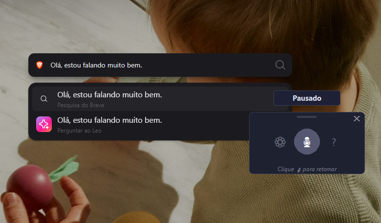
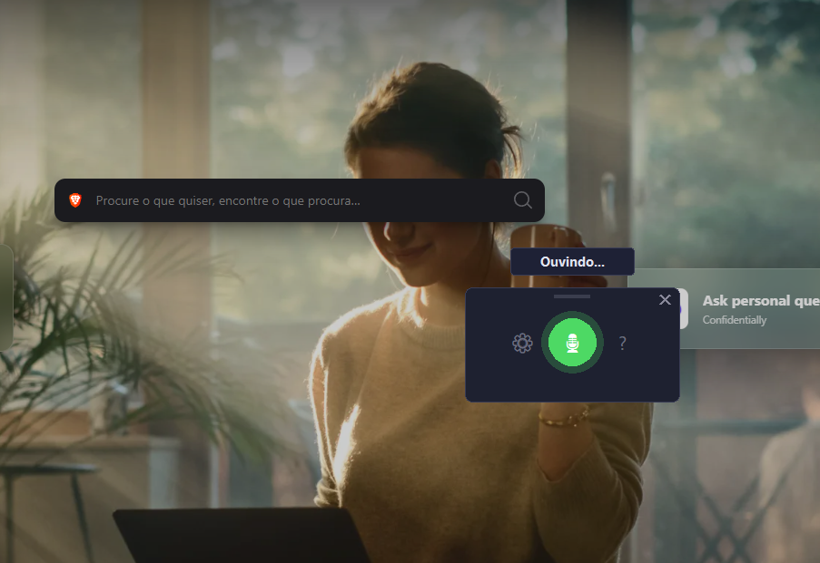

# Voice Dictation

  

**VoiceDictation** é um utilitário avançado desenvolvido em Python que utiliza Inteligência Artificial (Google Speech Recognition / Groq Whisper API) para transcrever áudio em tempo real e digitar automaticamente em qualquer janela ativa do Windows.

---

## 🎥 Demonstração Prática

Confira o Voice Dictation em ação. O vídeo abaixo demonstra a captação de áudio, a digitação dinâmica e o painel de configurações:

https://github.com/Mattys03/VoiceDictation/raw/master/assets/demo_video.mp4

### 📸 Imagens do Sistema

| Modo Ouvindo | Menu de Configuração e Histórico |
| :---: | :---: |
|  |  |

Abaixo você encontra a descrição detalhada do funcionamento observado na demonstração:

* **O Fluxo de Transcrição Bruta:** Ao ativar a ferramenta com o atalho, o widget flutuante entra no estado `"Ouvindo..."` com o microfone pulsando em verde perfeitamente sincronizado com o áudio captado. O texto ditado é inserido de forma fluida no editor de texto em foco.
* **Painel de Controle:** Através da engrenagem `⚙`, o usuário tem acesso a um modal profissional para:
  * **Atalho Customizável:** Facilidade para gravar novos atalhos globais (como `Alt + G`).
  * **Microfone:** Seleção livre de qualquer entrada de áudio física ou virtual (*Virtual Cables*, *Fifine*, etc).
  * **Motor de Transcrição:** Transição imediata entre "Google (Gratuito)" e a poderosa "Groq (Whisper API)".
* **Velocidade e Status Inteligente:** Após o ditado, o widget adquire um brilho dourado e exibe `"Transcrevendo..."`, indicando que a rede neural está processando a string, finalizando com a pontuação automática.
* **Sistema de Histórico (Clipboard):** Através do botão `?`, a aplicação exibe as transcrições recentes gravadas em memória. Clicar em um texto aciona `"Texto colado!"` e a aplicação imediatamente repete a digitação.

---

## 📖 Como o Projeto Começou e Por Que Foi Criado?

A ideia principal do **Voice Dictation** nasceu da necessidade de ter uma ferramenta robusta, rápida e personalizável para **digitação por voz (Speech-to-Text)** no Windows, superando as limitações da ferramenta nativa do sistema (o famoso atalho `Win + H`).

**O problema da ferramenta nativa do Windows:**
* É limitada geograficamente e por idioma.
* Não permite trocar livremente os motores de reconhecimento de voz.
* Não possui um histórico acessível para reutilizar textos ditados.
* Nem sempre interage bem com ferramentas de terceiros e não permite a customização de atalhos globais.

**A Solução (O Porquê):**
O **Voice Dictation** foi criado para preencher essa lacuna, servindo como uma interface flutuante (widget) construída inteiramente em Python. A sua função principal é permitir que o usuário, com o toque de um atalho totalmente configurável, possa falar livremente e ver seu texto sendo digitado instantaneamente em **qualquer aplicativo** que estiver em foco (Bloco de notas, navegadores, editores de código, chats, etc). 

O diferencial é a adoção de APIs de Inteligência Artificial modernas. O usuário pode optar pelo motor gratuito do Google ou usar o estado da arte com a API da **Groq (Whisper)**, garantindo velocidade impressionante e precisão semântica para jargões complexos ou sotaques regionais.

---

## ⚙️ Como Funciona a Arquitetura do Projeto?

O sistema foi desenvolvido utilizando Python moderno e foca em duas frentes: uma interface de usuário extremamente fluida e um backend de processamento de áudio invisível.

* **Interface Visual (UI):** Utiliza a biblioteca nativa `tkinter` com um design translúcido. A janela recebe propriedades de remoção de bordas nativas e *always on top*. Foi implementado um sistema de *drag-and-drop* para movimentação livre e animações baseadas em frequência (pulsando conforme o decibel do áudio).
* **Injeção de Texto Dinâmica:** Através de integrações com a API do Windows (`ctypes`), o sistema detecta automaticamente qual janela está em foco na tela (`GetForegroundWindow`) e "injeta" os caracteres simulando digitação humana em nível de hardware.
* **Sistema de Atalhos (Hotkeys):** O projeto utiliza a API robusta do Windows (`RegisterHotKey`), garantindo que o atalho seja capturado diretamente no Kernel do sistema operacional, funcionando de forma 100% confiável independente de jogos em tela cheia ou outros softwares em execução.
* **Módulo de Auto Pontuação (Smart NLP):** O código possui um módulo capaz de compreender intenções. Ele capitaliza inícios de frases, atende a comandos de voz literais (ao falar "vírgula", ele digita `,`) e possui regras gramaticais embutidas que inserem pontuação dinamicamente.

---

## 🔧 Requisitos e Padrões de Operação

O Voice Dictation opera sob uma arquitetura de alta performance que estabelece os seguintes padrões técnicos de funcionamento:

1. **Workflow Ininterrupto (Flow State):** Projetado para que o usuário não precise tirar a mão do mouse ou fechar programas. Os atalhos globais mantêm o foco total na tarefa original, operando de forma universal (do Discord a softwares de edição).
2. **Processamento em Nuvem:** A aplicação repassa o áudio para instâncias ultra-rápidas na nuvem (Groq/Whisper via LPUs ou Google). Isso requer uma conexão de internet para o tráfego das requisições REST durante a fase de `"Transcrevendo..."`.
3. **Integração Exclusiva Windows:** O núcleo de captação de *hotkeys* e foco foi arquitetado utilizando as bibliotecas nativas de baixo nível da Microsoft (`ctypes.windll.user32`), garantindo tempo de resposta na casa dos milissegundos no Windows, não sendo necessário para outros sistemas operacionais.
4. **Gerenciamento de API (Groq):** O uso da API proprietária da Groq possibilita que os desenvolvedores conectem suas chaves customizadas no arquivo `config.json`, ajustando o poder de processamento diretamente com a provedora do serviço.

---

## 📦 Configuração e Uso

1. Faça o download da Release mais recente (topo da página).
2. Abra o arquivo `config.example.json` e renomeie para `config.json`.
3. Insira a sua própria chave de API da Groq (caso queira utilizar o Whisper ultrarrápido) ou deixe em branco para usar o motor gratuito padrão do Google.
4. Execute o arquivo `Start_VoiceDictation.vbs` para iniciar a ferramenta de forma limpa, sem console poluindo a tela.
5. Pressione seu atalho (padrão inicial no painel de Configurações) e comece a falar.

## 📝 Licença
Distribuído sob a Licença MIT.
